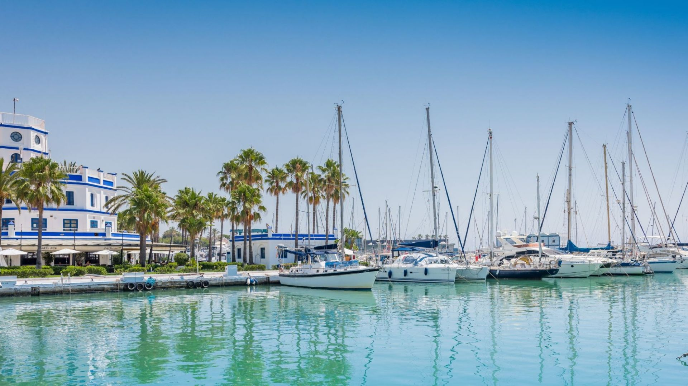

# Explore Estepona

Explore Estepona is a comprehensive online platform dedicated to facilitating travelers in meticulously planning and organising their vacations to the stunning Estepona region of Southern Spain. Whether its the myriad attractions nestled within Estepona itself or the enchanting locales in its vicinity, our blog serves as a valuable resource for tourists seeking guidance on how to make the most of their stay. Through detailed insights, recommendations, and tips, we aim to empower visitors with the information they need to curate an unforgettable experience tailored to their preferences and interests. 

### Deployed Site: [Explore Estepona](*Live Site*)

## User Experience (UX)

### Project Goals

The goal of the project is to allow users who are travelling to the Estepona region of Spain to get ideas of trips they could plan. 

### User Stories

- As a Site User I can view and understand what the purpose of the website is. 
- As a Site User I can view blog posts on the website.
- As a Site User I can open the blog post and view the entire post. 
- As a Site User I can view comments left by other users on a blog post.
- As a Site User I can register as a user for the site.
- As a Site User once registered I can comment on a blog post.
- As a Site User I can modify or delete previous comments I have posted.
- As a Site Admin I can manage posts allowing me to create, edit or delete blog posts.
- As a Site Admin I can create draft blog posts, allowing me to pause and come back to finish.
- As a Site Admin I can approve comments before other users can view them. 

### Future Features

- As a Site User I can view my profile account for the website. 
- As a Site User I can edit details on my profile.
- As a Site User I can view current pings or ping a location on google maps for locations mentioned in a blog post.
- As a Site User I can create, view, edit and delete my own blog posts. 

## Design

### Background Image 

In developing the page for Explore Estepona, I aimed for a unigueness beyond simple colors. Therefore, I opted to incorporate the image of Estepona Port, considering its charming significance within Estepona. 

